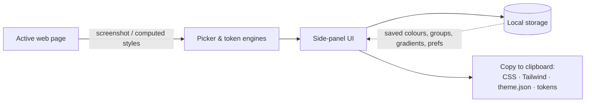

# Architecture

A high-level overview of how Studio Colour is built. *(This is a conceptual map, not a code reference — the application source is private.)*

## Stack

- **Platform:** Chrome Extension, **Manifest V3** — service-worker background + the **Side Panel API** for the UI.
- **Language:** **vanilla JavaScript** (ES6+) — no framework. HTML + CSS for the interface.
- **Payments:** [ExtensionPay](https://extensionpay.com) (Stripe-backed) for freemium licensing.

## Components

| Component | Responsibility |
|---|---|
| **Side-panel UI** | The whole interface — tabs for Adjust, Contrast, Saved, Extract, Gradient, Wheel, Tokens. |
| **Picker engine** | Captures the visible tab, overlays a magnifier loupe with a pixel grid, and samples colours — including continuous multi-pick the native eyedropper can't do. |
| **Colour-space engine** | Conversions between sRGB, HSL/HSB, CMYK, LAB, LCH, OKLCH and Display-P3, with zero round-trip drift. |
| **Contrast grader** | WCAG and APCA scoring with a 5-tier live grade and a one-click Fix that adjusts lightness only, preserving hue. |
| **Gradient studio** | Linear/radial gradients with positioned, draggable stops; exports to CSS and Tailwind. |
| **Token extractor** | Reads a live page's computed styles to lift its design system (colours, type scale, spacing, radii, shadows) and formats it for a target builder. |
| **Entitlements** | A small client layer (limits + monthly usage + upgrade prompts) gating the Pro features. |

## Data flow (simplified)

## Notable details

- **Canvas pixel sampling** powers the magnifier loupe (`getImageData` on a captured frame).
- **Hand-written colour maths** rather than a dependency — verified for zero round-trip error across all supported spaces.
- **Local-first:** all saved data lives in the browser's extension storage. There is no server, no analytics, and no telemetry. The only data exchanged off-device is the email tied to a Pro licence, handled by the payment provider.

## Privacy posture

Studio Colour reads a page's styles or pixels **only in response to an explicit user action** — never in the background. Nothing about the pages you sample is stored or transmitted.
